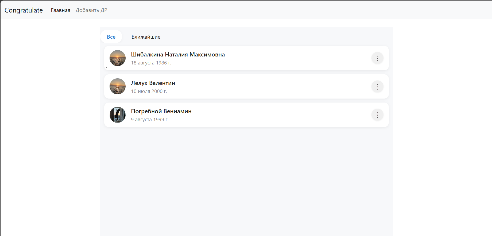
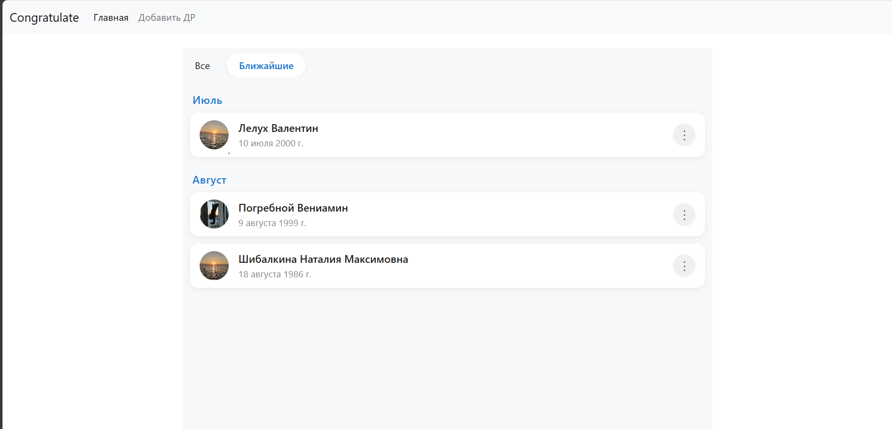
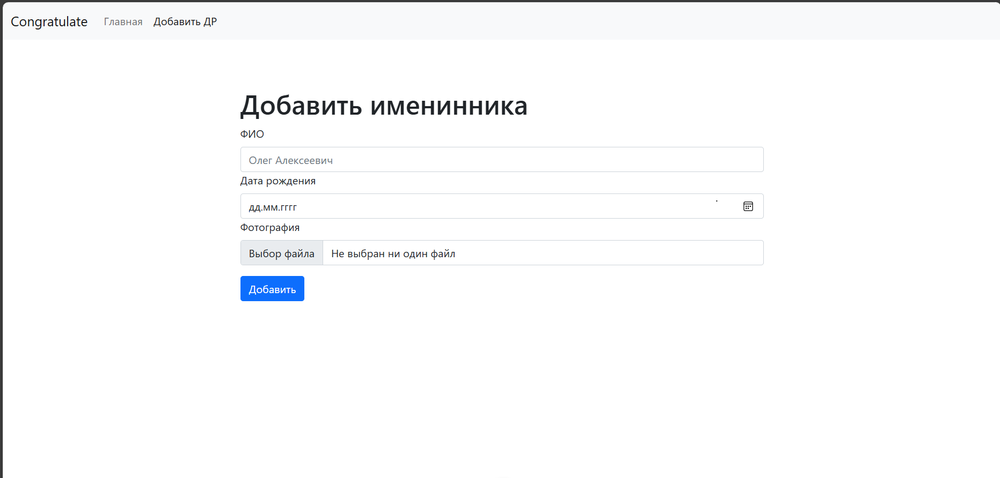
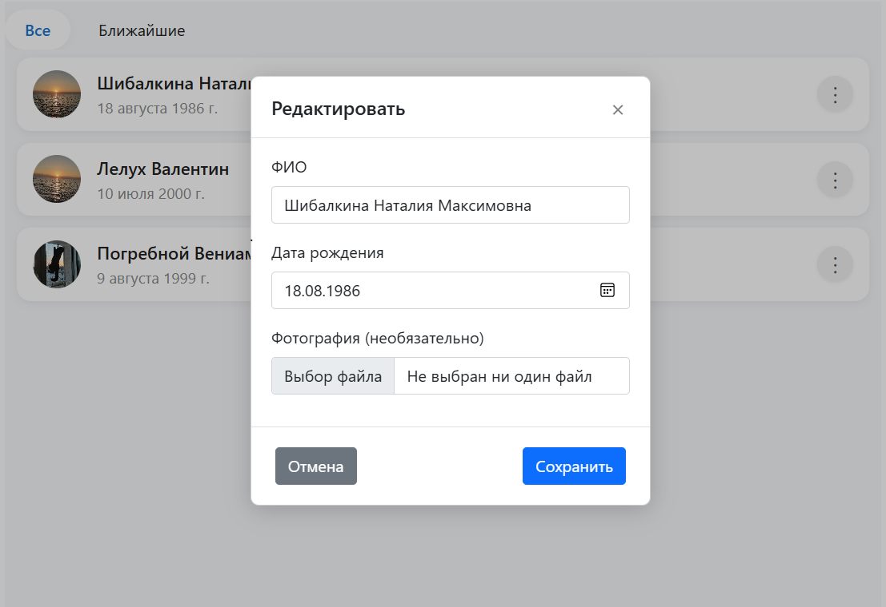

# Congratulate

Приложение, чтобы не забыть о важных событиях в жизни других людей.

## Структура проекта
- **Back/** — бэкенд на ASP.NET Core 
- **Front/** — фронтенд на Vue 3 (Vite, Pinia)
- **docker-compose.yml** — запуск PostgreSQL и pgAdmin 

---

## Как запустить

1. **Клонировать репозиторий:**
   ```sh
   git clone https://github.com/koliblin/Congratulate.git
   ```

2. **Запустить базу данных через Docker Compose:**
   ```sh
   docker-compose up -d
   ```

3. **Backend (ASP.NET Core):**
   - Перейти в папку `Back/Congratulate.API`
   - Запустить:
     ```sh
     dotnet run
     ```
     - **Миграции** :
     ```sh
     cd Back
     dotnet ef database update
     ```

4. **Frontend (Vue 3):**
   - Перейти в папку `Front`
   - Установить зависимости:
     ```sh
     npm install
     ```
   - Запустить dev-сервер:
     ```sh
     npm run dev
     ```

5. **Доступ:**
   - Фронтенд: [http://localhost:5173](http://localhost:5173)
   - Бэкенд (Swagger): [http://localhost:5087/swagger](http://localhost:5087/swagger)
   - pgAdmin: [http://localhost:7777](http://localhost:7777) (логин/пароль см. в docker-compose.yml)

---

## Демонстрация работы

### Главная страница


### Вкладка "Ближайшие"


### Добавление именинника


### Редактирование записи



---
 
